# Project plan

## Objective

The objective of our project is to provide analytical datasets from World Bank's Global Economic Monitors.

## Consumers

What users would find your data useful? How do they want to access the data?

> The users of our datasets are Data Analysts in the Economics Research team. 

## Questions

What questions are you trying to answer with your data? How will your data support your users?

> - Which are the top 10 largest economies by gdp in the world?
> - How hasthe value of exports changed for each country over the years?
> - What changes have happened in the industrial world for each country?
> - Which country had the highest or lowest employment rates by region and by year?
> - which countries have had the fastest Consumer Price Index over time?
> - What is the relationship between the different economic indicators?

## Source datasets

What datasets are you sourcing from? How frequently are the source datasets updating?

> World Bank economic indicators and their codes are listed in https://datatopics.worldbank.org/world-development-indicators/themes/economy.html
> 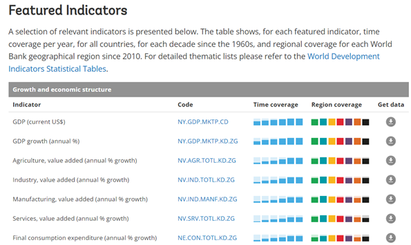

>
> Specifically, we will start exploring these data sets
> - Unemployment Rate
> - Industrial Production
> - Exports Merchandise
> - CPI Price
> - GDP
> 
>
>   Note:
>   - The source datasets are available via API. The data is updated at a yearly granularity.
>   - Basic API call structure: https://api.worldbank.org/v2/countries/all/indicators/NY.GDP.MKTP.CD?date=2023
>   - API keys and other authentication methods are not necessary to access the API.

## Solution architecture

> 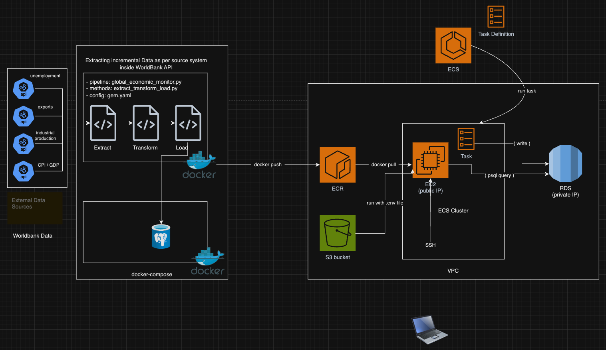

How are we going to get data flowing from source to serving? What components and services will we combine to implement the solution? How do we automate the entire running of the solution?

> - What data extraction patterns are you going to be using? Incremental Extract
> - What data loading patterns are you going to be using? Upsert
> - What data transformation patterns are you going to be performing?
>   - transform raw data: filter, rename, dropna, change column type, merge
>   - transform_sql : using SQL queries and window function rank()

**Features**:
-	Economic indicators can be dynamically added or removed through the usage of dictionaries (key value pairs) in yaml file 
-	The key refers to the code of the economic indicator e.g. FP.CPI.TOTL is the code for CPI, while the value "cpi" is the name of the table that will be created in postgres.
-	The main function retrieves the dictionary from YAML. It then iterates through each key-value pair in this dictionary, executing the ETL pipeline for every indicator specified.
-	The ETL pipeline will create 2 tables in postgres for each economic indicator - one with the original data, and another with averages and ranking.

**ELT/ETL techniques applied:**
- Object oriented programming
-	Classes: api, postgres, pipeline logging, metadata logging
-	A common ETL function
-	A common main function
- YAML
- Jinja 
- Data loading pattern: Upsert
- Data extraction pattern: Incremental 
    - 1 - If database table doesn't exist, it is considered 1st run, and the date_range in yaml will be used to perform a full extract. 
   -  2 - Subsequent runs will be incremental. The maximum value in year column will be queried and +1. Max year + 1 will be passed as date param into API.

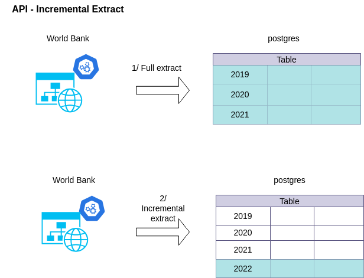

- Transformations (before loading) - rename columns, dropna, merge, change datatype of column
- Transformations (after loading) - using jinja files, Create Table As and Partition By to create a ranked table for each economic indicator. 

## Breakdown of tasks

> See GitHub project [Kanban board](https://github.com/users/suphineneo/projects/1/views/1?visibleFields=%5B%22Title%22%2C%22Assignees%22%2C%22Status%22%2C135941698%2C135941700%2C135941699%2C%22Labels%22%5D)

## Deployment to Amazon Web Services

1. Elastic Container Registry (ECR) - screenshot of image in ECR

    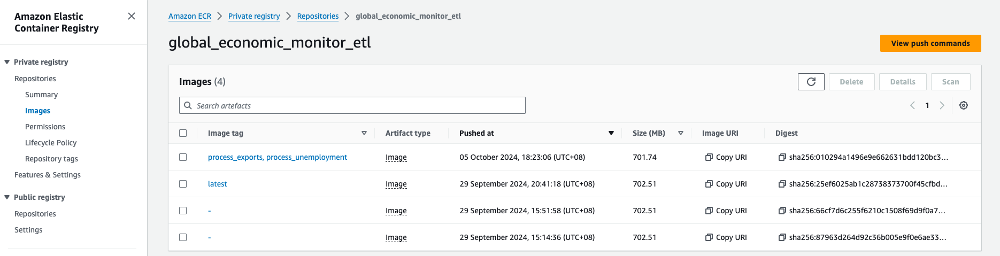

2. Elastic Container Service (ECS) - screenshot of scheduled task in ECS

    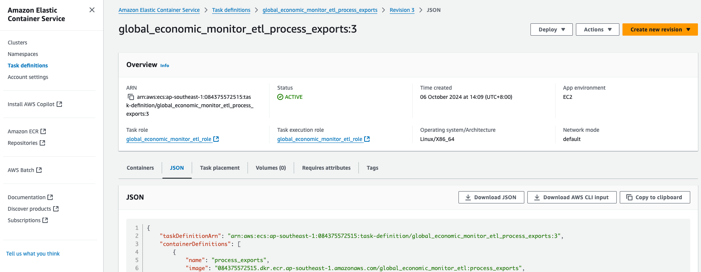
    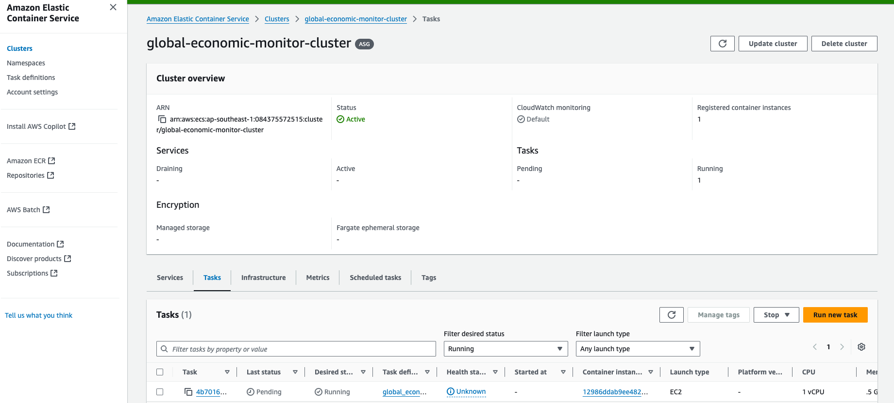
    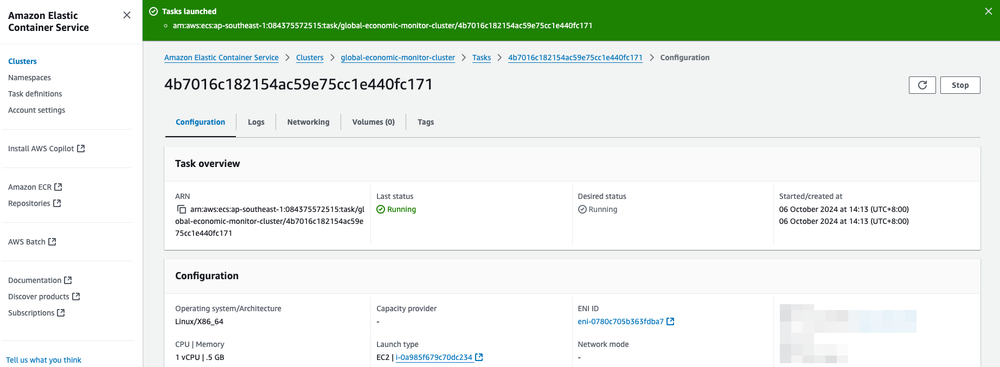
    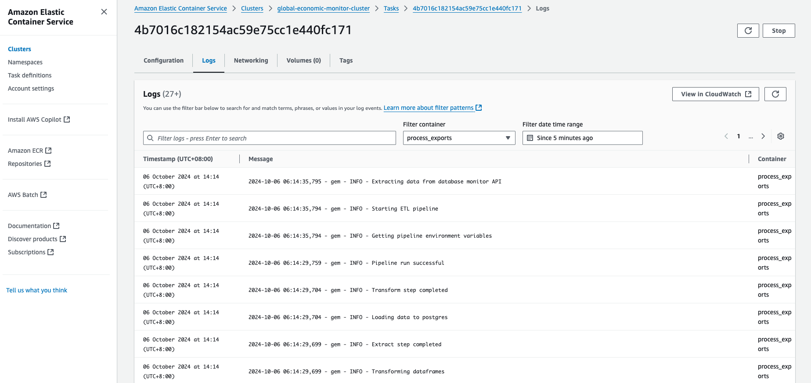

3. Relational Database Service (RDS) - screenshot of dataset in target storage
    - We set up a Postgres instance in RDS with no public access
    - We also set up an EC2 instance with public IP as a gateway/bastion server and SSH into it to connect to the Postgres instance
    - The following screenshots show the tables and data in the Postgres instance.

    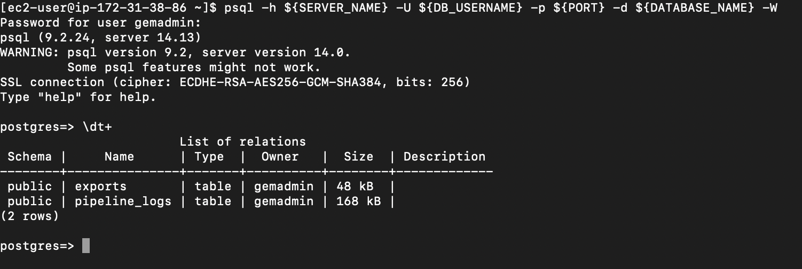
    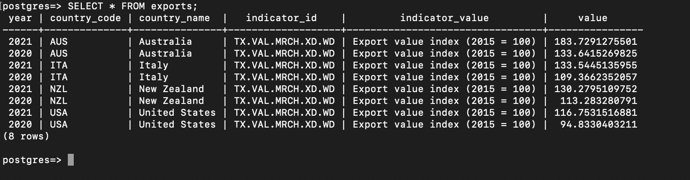
    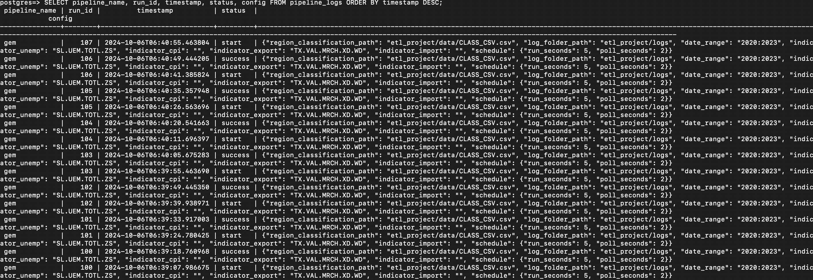

4. IAM Role - screenshot of created role

    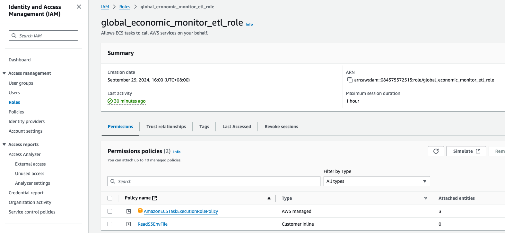

5. S3 for `.env` file - screenshot of `.env` file in S3

    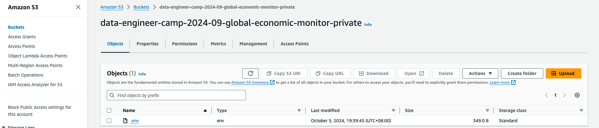

## Learnings

- Integrate early, integrate often
- Use tests to guard against code regression
- Deploy early, deploy often to get code running in a production or production-like environment
